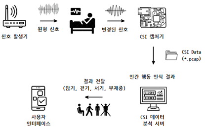
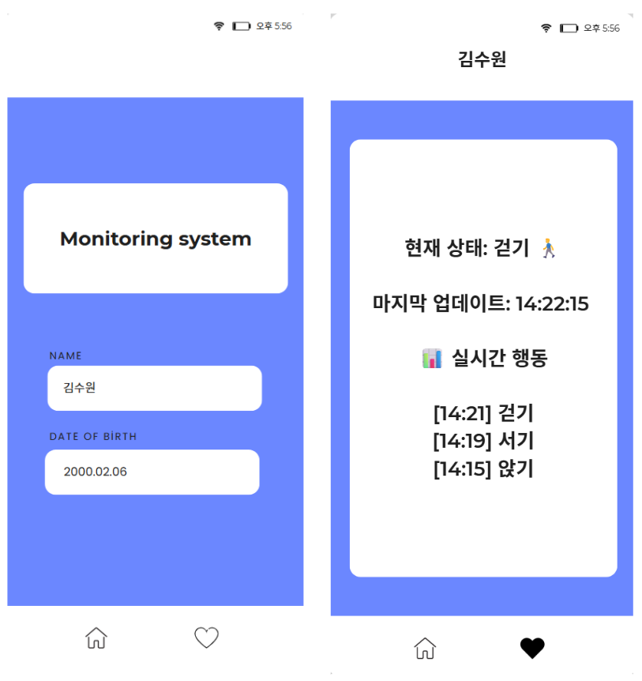

# 🏥 CSI 기반 무자각 환자 행동 모니터링 시스템

본 프로젝트는 **채널 상태 정보(Channel State Information, CSI)**를 활용하여 환자의 행동을 무자각으로 모니터링하는 시스템입니다.  
병실이나 재활시설에서 환자의 움직임을 실시간으로 감지하고, 머신러닝 모델로 분석하여 안전사고 예방 및 재활 효과 증진을 목표로 합니다.  

---

## 🔍 연구 배경

- 기존 HAR(Human Activity Recognition) 기술은 **웨어러블 센서**나 **카메라** 활용  
  - 장비 착용 불편, **사생활 침해** 문제 발생  
- CSI 기반 HAR 기술은 **OFDM 신호 패턴 분석**으로 행동 인식 가능  
  - 하나의 패킷 전송에서 부반송파별 진폭과 위상 정보 수집  
  - 미세한 신체 움직임도 정밀 포착 가능  

---

## 🏗 시스템 구조

제안 시스템은 다음으로 구성됩니다:

1. **📡 신호발생기**: OFDM 신호 지속 생성 및 브로드캐스트  
2. **📶 CSI 캡처기**: 신호 수신 → CSI 데이터 수집  
3. **🖥 CSI 데이터 분석 서버**:  
   - 전처리 → 노이즈 제거  
   - 진폭 값 추출 → Heatmap 이미지 생성  
   - CNN 모델 입력 → 행동 분류 (Sitting, Walking, Standing, Empty)  
4. **📱 사용자 인터페이스(UI)**: 실시간 행동 상태 표시 및 기록 제공  

**그림 1. 무자각 환자 행동 모니터링 시스템 구조**   

---

## ⚙ 구현 및 실험

### 하드웨어/소프트웨어 구성

| 구성 요소 | 설명 |
| -------- | --------------------------------------------------- |
| 신호발생기 | OpenWrt 탑재 상용 AP, IEEE 802.11n, 20MHz, 7번 채널 |
| CSI 캡처기 | Raspberry Pi 4 B + BCM43455C0 + Nexmon |
| 분석 서버 | Python + TensorFlow/Keras |

- 병실 환경 모사 → **Sitting, Walking, Standing, Empty** 행동 데이터 수집  
- 행동별 **2,500개 pcap 파일**, pcap 당 20개의 CSI 데이터 포함  
- 전처리: 64개 부반송파 중 12개 제거, 나머지 52개 진폭 계산  
- 20개의 연속 CSI 데이터 → **Heatmap 이미지** 변환  

---

### 🧠 CNN 모델 구성

| 모듈 | 구성 |
| ---- | ---- |
| Feature Extractor | 5개의 합성곱-풀링 계층, ReLU 활성화 |
| Classifier | Fully Connected 1개 계층, Softmax로 행동 분류 |

- 학습: 데이터 **80% 학습용**, **20% 검증용**  
- 결과: 총 2,000 이미지 중 **1,770개 올바르게 분류** (**정확도 88.5%**)  

**그림 2. CNN 모델 구조**  

**표 1. 행동 분류 결과**

| 행동 | Sitting | Walking | Standing | Empty |
| ---- | ------- | ------- | -------- | ----- |
| ✅ True (정확) | 400 | 480 | 500 | 390 |
| ❌ False (오분류) | 100 | 20 | 0 | 110 |

---

### 🖥 사용자 인터페이스

- 환자의 **현재 행동 상태** 실시간 표시  
- 마지막 업데이트 시간 및 행동 기록 순서 표시  

**그림 3. 사용자 인터페이스**  

---

## 📊 결론

- CSI 기반 **무자각 환자 행동 모니터링 시스템 구현 및 실험 완료**  
- 실측 데이터 예측 정확도: **88.5%**  
- 환자의 움직임 변화를 **실시간, 정확하게 감지 가능** ✅  

---

